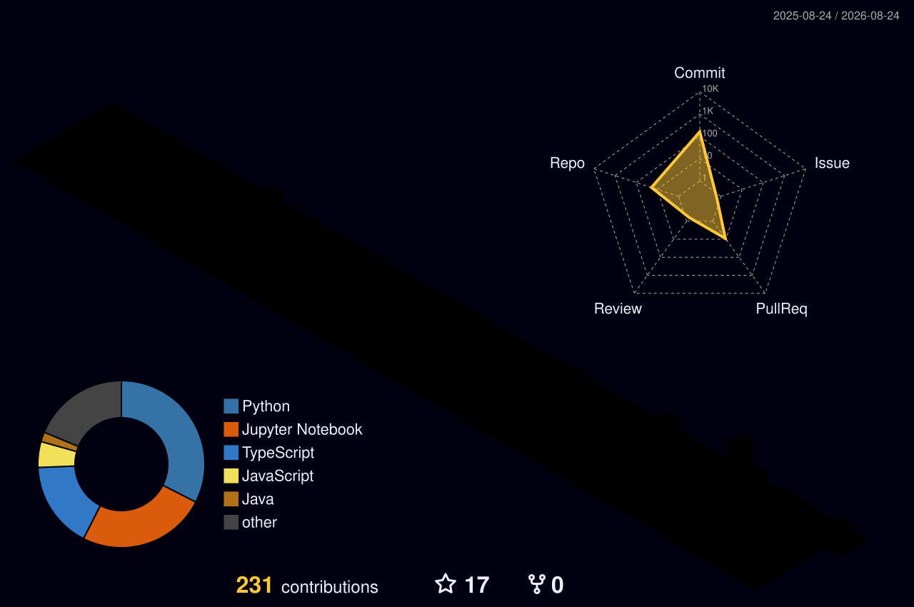

  

  

  

  
  &nbsp;
  
  &nbsp;
  
  &nbsp;
  

---

## 🎮 PLAYER STATS

| 🧬 ATTRIBUTE | 📊 VALUE | 🏅 RANK |
|:---:|:---:|:---:|
| ⚔️ **CLASS** | Full Stack Dev × ML Engineer × AI Agents Builder | `ELITE` |
| 🎓 **LEVEL** | B.E. CSE @ SSN — Batch 2023–2027 | `FINAL YEAR` |
| 🏛️ **GUILD** | SSN College of Engineering, Chennai | `ACTIVE` |
| 📍 **LOCATION** | Chennai, India | `IND-SERVER` |
| ⚡ **SPECIALTY** | AI/ML · Agentic AI · RAG Systems | `LEGENDARY` |

| 📜 STAT | 🔋 XP BAR | 📈 SCORE |
|:---:|:---:|:---:|
| 💼 **INTERNSHIPS** | `██████████████████████ 100%` | **2** @ Tech Lift Digital |
| 🏆 **HACKATHONS** | `████████████████░░░░░░ 80%` | Top 10/260 TechnoVerse · SAP Finalist |
| 💻 **PROJECTS** | `██████████████████░░░░ 85%` | Full Stack · AI/ML · SaaS |
| 🧠 **AI SYSTEMS** | `████████████████░░░░░░ 80%` | RAG · Agentic AI · Transformers |

---

## 🧠 ABOUT ME

Computer Science Engineering student at SSN College of Engineering focused on **Full Stack Development, AI/ML, and Agentic AI**.

I build scalable web applications, SaaS platforms, RAG systems, AI agents, and machine learning applications. Currently exploring **system design, distributed systems, cloud technologies, and modern AI architectures** while building practical solutions for real-world problems.

---

## ⚔️ SKILL TREE

### 💻 Development

  

### 🧠 AI / ML

  

  
  
  
  
  

### 🗄️ Databases & Cloud

  

### 📊 Big Data

  
  
  
  

### 🔧 Tools

  

---

## 📊 3D CONTRIBUTION GRAPH

  

---

## 📈 CONTRIBUTION ACTIVITY

  

---

## 🚀 WHAT I BUILD

`Full Stack Applications`
&nbsp; · &nbsp;
`SaaS Platforms`
&nbsp; · &nbsp;
`AI Agents`
&nbsp; · &nbsp;
`RAG Systems`
&nbsp; · &nbsp;
`Machine Learning`
&nbsp; · &nbsp;
`REST APIs`
&nbsp; · &nbsp;
`Cloud Applications`

---

## 🔗 CONNECT WITH ME

---

  

